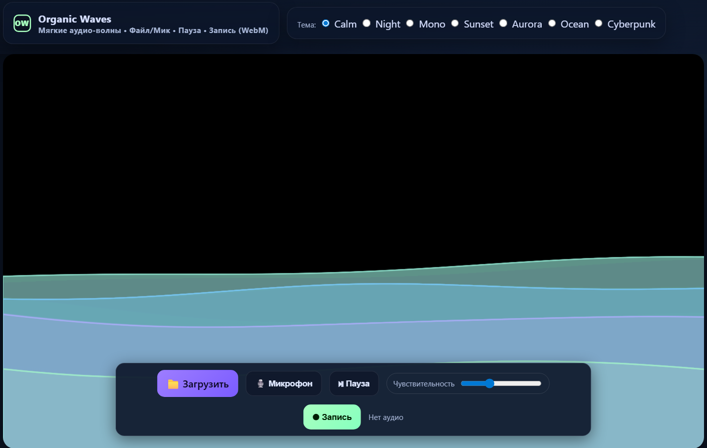
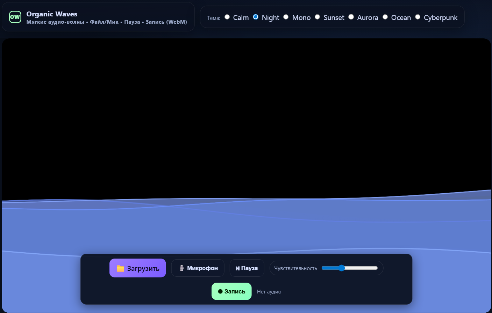
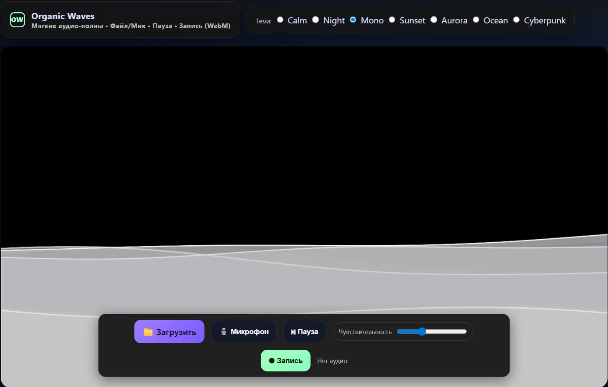
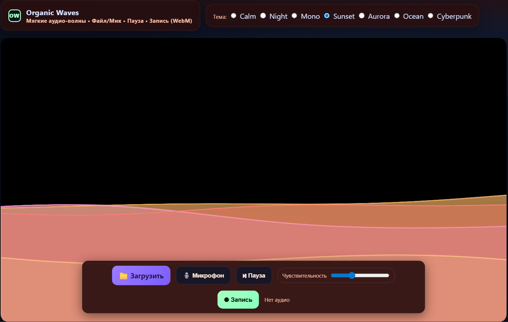
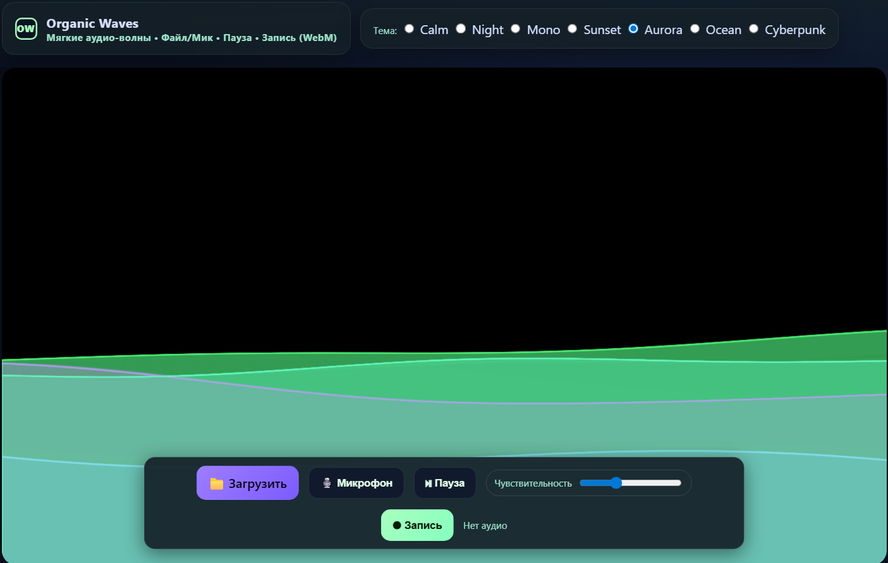
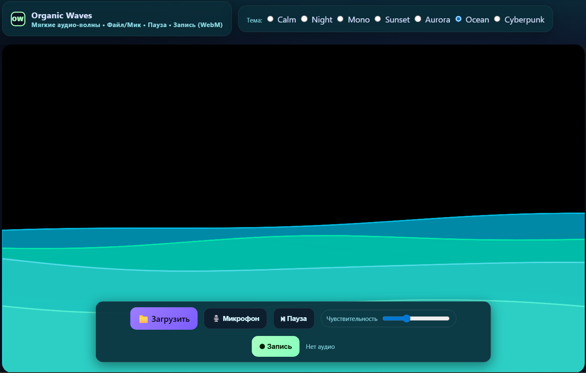
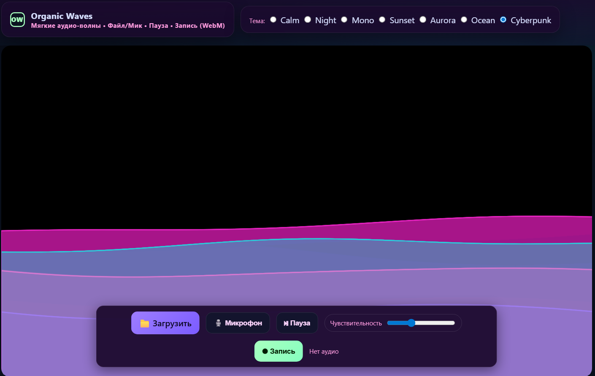

# Organic Waves

> Спокойная аудиовизуализация для стримов, фоновых роликов и арт-видео.  
> Создаёт мягкие «дышащие» волны под музыку или микрофон и позволяет **записывать результат в видеофайл (WebM)**.  

---

## Возможности

- Реакция на аудио (файл, микрофон или стрим)
- Несколько тем оформления:
  - Calm · Night · Mono
  - Sunset · Aurora · Ocean · Cyberpunk · Paper
- Луп-режимы для сторис и клипов
- Запись в `.webm` с сохранением анимации
- Управление прямо из HUD-панели:
  - Загрузка трека  
  - Микрофон  
  - Пауза / Продолжить  
  - Чувствительность микрофона  
  - Старт / Стоп записи

---

## Установка и запуск
Достаточно перейти на сайт:
https://orwaves.netlify.app/

---

## Галерея тем

| Calm | Night | Mono |
|------|-------|------|
|  |  |  |

| Sunset | Aurora | Ocean |
|--------|--------|-------|
|  |  |  |

| Cyberpunk |
|-----------|
|  |

---

## FAQ

**Почему запись в `.webm`, а не `.mp4`?**  
WebM поддерживает прозрачность и подходит для браузеров.  

**Можно писать с микрофона и будет ли автостоп?**  
Да, микрофон работает. Автостоп недоступен, поскольку неизвестна финальная длительность аудиофрагмента.  

**Что даёт «Чувствительность»?**  
Регулирует реакцию волн на амплитуду аудиосигнала.  

---

## Технологии

- Canvas API (отрисовка волн)
- Web Audio API (анализатор спектра)
- MediaRecorder API (запись WebM)
- Чистый JS + CSS Variables для темизации

---

## Лицензия

MIT — можно свободно использовать и модифицировать.  
